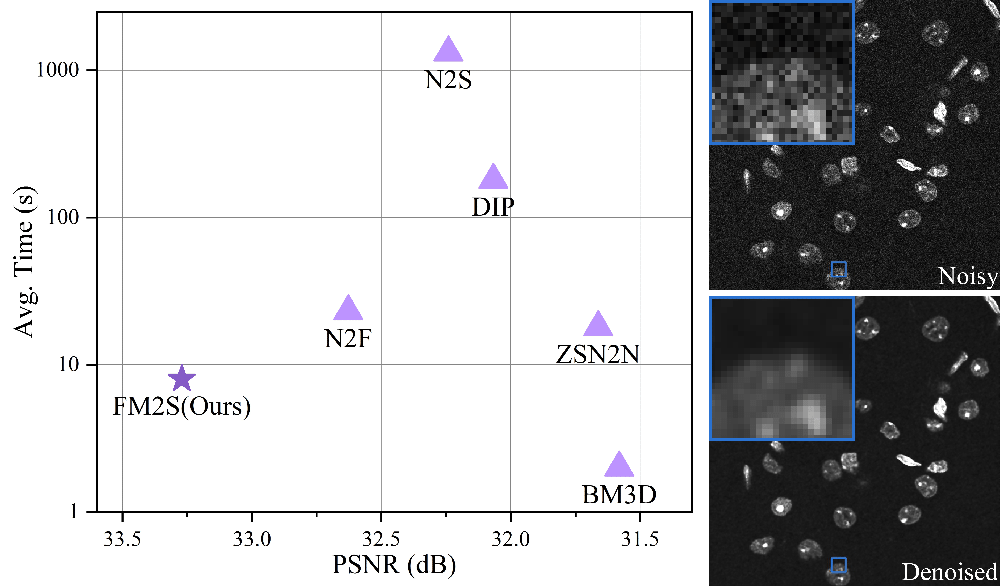
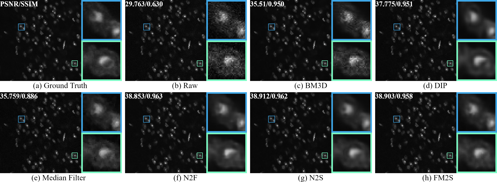

# FM2S: Self-Supervised Fluorescence Micrograph Denoising With Single Noisy Image

-   [FM2S: Self-Supervised Fluorescence Microscopy Denoising With Single Noisy Image](https://arxiv.org/abs/2412.10031).

## Abstract
Fluorescence microscopy has significantly advanced biological research by visualizing detailed cellular structures and biological processes. However, such image denoising task often faces challenges due to difficulty in precisely modeling the inherent noise and acquiring clean images for training, which constrains most existing methods. In this paper, we propose an efficient self-supervised denoiser Fluorescence Micrograph to Self (FM2S), enabling a high-quality denoised result with a single noisy image. Our method introduces an adaptive global-local Noise Addition module for data augmentation, addressing generalization problems caused by discrepancies between synthetic and real-world noise. We then train a two-layer neural network to learn the mapping from the noise-added image to the filtered image, achieving a balance between noise removal and computational efficiency. Experimental results demonstrate that FM2S excels in various microscope types and noise levels in terms of denoising effects and time consumption, obtaining an average PSNR improvement of around 6 dB over the original noisy image in a few seconds.

## Visualization

## Getting Start
It is recommanded to use virtual environment.

	conda create -n FM2S python=3.9
	conda activate FM2S
	pip install -r requirements.txt

## Data

Our data is from FMD (Zhang et al. 2019) dataset. [link]([yinhaoz/denoising-fluorescence: CVPR 2019: Fluorescence Microscopy Denoising (FMD) dataset](https://github.com/yinhaoz/denoising-fluorescence))

## Denoising
If a image is in grayscale, use the following command

	python main.py -in_path samples/grayscale/noisy.png -out_path g_out.png

For a color image, use the following command

	python main4D.py -in_path samples/color/noisy.png -out_path c_out.png

## Hyperparameters
A set of hyperparameters can be modified, including Sample Size (SS), Epoch Per Image (EPI), and Amplification Factor (AMP).

	python main.py -in_path samples/grayscale/noisy.png -out_path g_out.png -SS 75 -EPI 150 -AMP 2

## Evaluation
PSNR and SSIM are used for denoising evaluation. To compute PSNR and SSIM for a denoised image, use the following command

	python eva.py -gt samples/grayscale/gt.png -test g_out.png
